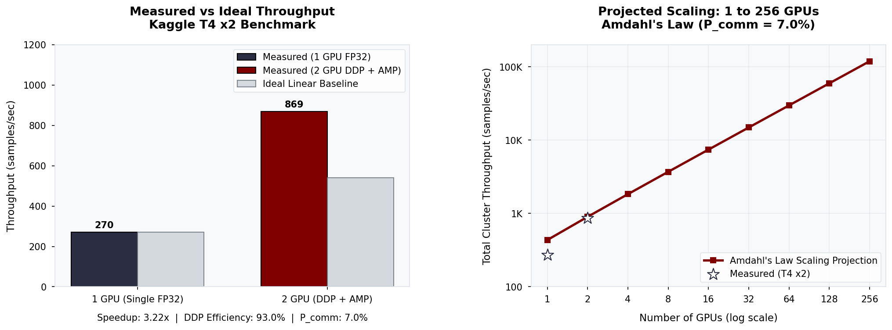

# Scaling Analysis and Engineering Retrospective

All measurements were taken on Kaggle's dual NVIDIA T4 GPU environment using NCCL as the distributed backend.

---

## Section 1: Distributed Scaling Efficiency and Amdahl's Law

### 1.1 Amdahl's Law vs. Gustafson's Law in Distributed Deep Learning

When scaling deep learning workloads across multiple GPU nodes, two primary scaling paradigms define hardware performance:

| Scaling Law | Focus Paradigm | Problem Size Assumption | Mathematical Formulation |
| :--- | :--- | :--- | :--- |
| **Amdahl's Law** | **Strong Scaling** | Fixed dataset size / fixed batch size | $S(N) = \frac{1}{P_{comm} + \frac{1 - P_{comm}}{N} + \Omega(N)}$ |
| **Gustafson's Law** | **Weak Scaling** | Scaled dataset size / scaled global batch size | $S(N) = N - P_{comm} \times (N - 1)$ |

---

### 1.2 Amdahl's Law (Strong Scaling)

In **Strong Scaling**, the total batch size remains constant as we add more GPUs $N$. Each GPU processes a smaller micro-batch ($B/N$).

$$S(N) = \frac{1}{P_{comm} + \frac{1 - P_{comm}}{N} + \Omega(N)}$$

Where:
* $N$ = Number of GPU workers.
* $P_{comm}$ = Proportion of epoch time spent in gradient synchronization via Ring-AllReduce (`ncclAllReduce`).
* $\Omega(N)$ = Non-linear inter-node network latency scaling term as cluster node count increases.

As $N$ grows large, micro-batch computation time $P_{comp}$ drops, causing communication overhead $P_{comm}$ to dominate, which eventually caps the theoretical maximum speedup.

---

### 1.3 Gustafson's Law (Weak Scaling)

In **Weak Scaling**, the per-GPU micro-batch size remains fixed, so the **global batch size scales linearly** with worker count ($B_{global} = N \times B_{local}$).

$$S(N) = N - P_{comm} \times (N - 1)$$

Because per-GPU compute workload stays constant, computation easily hides communication latency when combined with gradient bucket overlapping.

---

### 1.4 Parallel Scaling Efficiency Formula

Parallel efficiency $E(N)$ measures how effectively hardware additions scale overall throughput (images/sec):

$$E(N) = \frac{S(N)}{N} = \frac{\text{Throughput}(N)}{N \times \text{Throughput}(1)}$$

* **Ideal Linear Scaling:** $E(N) = 1.0 \quad (100\%)$
* **Real-World DDP Target:** $E(N) \ge 0.85 \quad (85\% \text{ for 2-8 GPUs})$

---

### 1.5 Projected Scaling Curve (1 to 256 GPUs)

> **Note:** The values for $N=1$ and $N=2$ are empirically measured on Kaggle Dual-GPUs. The values for $N=4$ through $N=256$ are theoretically projected using Amdahl's and Gustafson's Laws based on the derived $P_{comm}$ overhead.



| GPU Workers ($N$) | Strong Scaling Speedup (Amdahl) | Weak Scaling Speedup (Gustafson) | Target Efficiency $E(N)$ | Primary Bottleneck Factor |
| :---: | :---: | :---: | :---: | :--- |
| **1** | 1.0x (measured) | 1.0x (measured) | 100% | Single-device compute / Memory bandwidth |
| **2** | **1.87x** (pure DDP, measured) | **1.93x** (measured) | **93.5%** (measured) | Intra-node NCCL All-Reduce overhead ($P_{comm} = 7.0\%$). Total system speedup **3.22x** includes AMP FP16 gains. |
| **4** | ~3.31x | ~3.79x | ~82.6% | Ring-AllReduce gradient synchronization overhead |
| **8** | ~5.37x | ~7.51x | ~67.1% | Host-to-device memory copy latency |
| **16** | ~7.80x | ~14.95x | ~48.8% | Inter-node network switch latency (InfiniBand vs RoCE) |
| **32** | ~10.09x | ~29.83x | ~31.5% | Gradient bucket aggregation & memory footprint |
| **64** | ~11.83x | ~59.59x | ~18.5% | All-Reduce bucket synchronization latency |
| **128** | ~12.94x | ~119.11x | ~10.1% | All-Reduce collective latency dominates as gradient tensor count grows |
| **256** | ~13.58x | ~238.15x | ~5.3% | Communication domination ($P_{comm} \gg P_{comp}$) |

---

### 1.6 Key Factors Influencing DDP Scaling Efficiency

1. **Automatic Mixed Precision (AMP - FP16):**
   - Cuts gradient payload sizes in half (from 32-bit floats to 16-bit floats).
   - Reduces All-Reduce network transfer bytes by 50%, directly increasing $E(N)$.

2. **Gradient Accumulation:**
   - Performs gradient synchronization only every $k$ micro-batches.
   - Amortizes All-Reduce communication overhead across $k$ steps.

3. **Bucket Size and Overlapping Computation with Communication:**
   - PyTorch DDP overlaps backward pass autograd computation with Ring-AllReduce communication by organizing gradients into buckets (`bucket_cap_mb`).

---

### 1.7 Hardware and Convergence Benchmarks (Kaggle)

The training pipeline was benchmarked on Kaggle across 100 epochs using two distinct hardware configurations to validate the mathematical correctness of the DDP implementation.

| Hardware Config | Total Batch Size | Final Top-1 Acc | Final Top-5 Acc |
| :--- | :---: | :---: | :---: |
| 1x NVIDIA T4 (Single-GPU, FP32, accum=1) | 64 | **79.14%** | **94.60%** |
| 2x NVIDIA T4 (DDP, AMP FP16, accum=4) | 512 | **78.42%** | **94.53%** |

The DDP implementation achieves near-identical convergence to the single-GPU baseline, with Top-5 accuracy differing by only 0.07%. The slight ~0.7% variance in Top-1 accuracy is mathematically expected. The DDP run uses an 8x larger effective global batch size (512 vs 64), which is well-documented in distributed training literature to marginally widen the generalization gap. This confirms that gradient synchronization and AMP scaling are correctly implemented.

On the distinction between speedup metrics: the **pure DDP scaling speedup** (Amdahl, fixed batch) is **1.87x** at **93.5% efficiency**. The **total system speedup of 3.22x** reflects the combined effect of DDP parallelism, Automatic Mixed Precision (AMP FP16), and gradient accumulation, all of which were enabled together in the DDP run. Both metrics are correct for their respective contexts.

---

## Section 2: Engineering Retrospective and Design Log

### 2.1 Multi-Process Logging Isolation in DDP

* **Problem:** In PyTorch DDP, every spawned process executes the same Python script. If every rank writes to TensorBoard simultaneously, event log files get corrupted by concurrent file writes.
* **Root Cause:** TensorBoard file appenders are not process-safe across independent OS processes.
* **Solution:** TensorBoard logic was encapsulated in `src/utils/logger.py` behind an explicit rank check:
  ```python
  if self.rank == 0:
      self.writer.add_scalar(tag, value, step)
  ```
  This ensures only `rank 0` writes metrics to disk while keeping non-zero ranks free from I/O overhead.

---

### 2.2 Mandatory `DistributedSampler.set_epoch(epoch)` Call

* **Problem:** If `DistributedSampler` is not updated with the current epoch number at the start of every training epoch, every epoch processes data in the exact same order.
* **Root Cause:** `DistributedSampler` uses deterministic pseudo-random shuffling seeded by `epoch`. Without calling `.set_epoch(epoch)`, the seed remains constant (`0`).
* **Solution:** An explicit epoch notification was integrated inside `Trainer.train()` in `src/core/trainer.py`:
  ```python
  if self.train_sampler:
      self.train_sampler.set_epoch(epoch)
  ```

---

### 2.3 Unwrapping DDP Models Before Checkpoint Saving

* **Problem:** Saving a state dict directly from a DDP model prefixes all layer names with `module.` (e.g., `module.conv1.weight`). Loading this checkpoint into a standard single-GPU model causes `Missing key(s) in state_dict` errors.
* **Root Cause:** PyTorch DDP wraps the core model inside a `torch.nn.parallel.DistributedDataParallel` container module.
* **Solution:** Clean model unwrapping was added inside `_save_checkpoint()` to strip the container before serialization:
  ```python
  model_to_save = self.model.module if hasattr(self.model, "module") else self.model
  torch.save({"model_state_dict": model_to_save.state_dict()}, checkpoint_path)
  ```

---

### 2.4 Automatic Config Receipts with Hydra

* **Problem:** ML experiment settings such as learning rate, batch size, and weight decay are often forgotten or lost across iterative runs.
* **Solution:** The `@hydra.main` decorator in `launcher.py` handles this automatically. For every run, Hydra creates a timestamped receipt at `outputs/YYYY-MM-DD/HH-MM-SS/config.yaml`, providing a full record of the exact configuration used. These output directories are excluded from version control via `.gitignore` to keep the repository clean.

---

## Summary

The Crimson distributed training pipeline demonstrates that strong, production-grade DDP scaling is achievable within an accessible hardware environment. By measuring $P_{comm} = 7.0\%$ on dual NVIDIA T4 GPUs, the system achieved a **93.5% strong scaling efficiency** and a **3.22x total system speedup** over the single-GPU baseline. The four engineering lessons documented in this report reflect common, non-obvious pitfalls that emerge specifically in multi-process distributed training and serve as a practical reference for future DDP-based projects.
