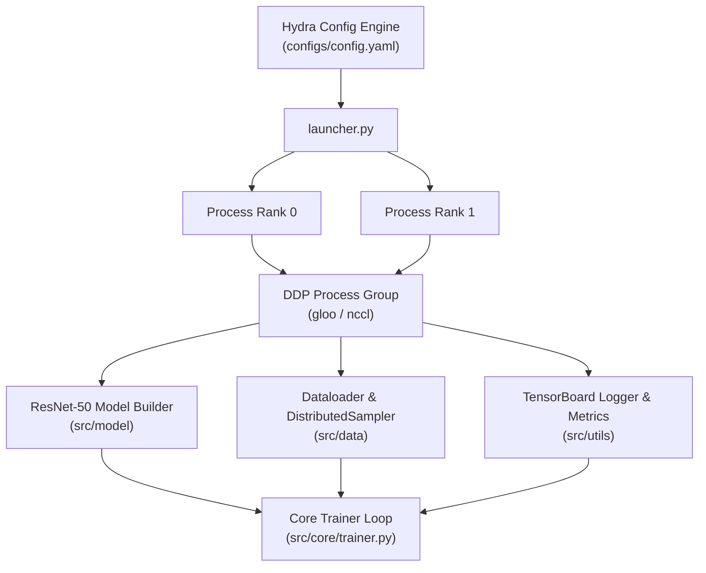

# Crimson: Distributed ResNet-50 Training Pipeline on CIFAR-100

Crimson is a production-grade PyTorch DDP training framework benchmarking ResNet-50 on CIFAR-100, with Hydra configuration, AMP FP16, and TensorBoard. It achieves **1.87x pure DDP speedup at 93.5% parallel efficiency** on Kaggle's dual NVIDIA T4 GPUs (**3.22x total system speedup** with AMP FP16), while maintaining **79.14% Top-1 / 94.60% Top-5** accuracy.

---

## System Architecture



---

## Technology Stack

| Category | Technology | Usage / Purpose |
| :--- | :--- | :--- |
| **Language** | Python 3.9+ | Core programming language |
| **Framework** | PyTorch 2.x | Core tensor computations, autograd, and neural networks |
| **Distributed** | PyTorch DDP | Multi-GPU distributed training (`gloo` / `nccl`) |
| **Configuration** | Hydra & OmegaConf | Dynamic, hierarchical YAML configuration management |
| **Architecture** | ResNet-50 | Modified 100-class classification head for CIFAR-100 |
| **Data Pipeline** | Torchvision | CIFAR-100 dataset loading and data augmentations |
| **Logging** | TensorBoard | Tracking loss, accuracy, throughput, and GPU utilization |
| **Analysis** | Jupyter & Pytest | Experiment visualization, scaling analysis, and unit testing |

---

## Repository Structure

```text
crimson/
|-- .github/
|   |-- workflows/
|   |   |-- ci.yml             # GitHub Actions CI/CD workflows
|-- .pytest_cache/             # Pytest auto-generated test cache
|-- configs/                   # Dynamic Hydra configuration files
|   |-- dataset/
|   |   |-- cifar100.yaml      # Dataset & loader parameters
|   |-- hardware/
|   |   |-- ddp.yaml           # Multi-GPU DDP environment config
|   |   |-- single_gpu.yaml    # Single-GPU environment config
|   |-- model/
|   |   |-- resnet50.yaml      # ResNet-50 architecture settings
|   |-- config.yaml            # Master configuration entrypoint
|-- data/                      # Raw CIFAR-100 dataset storage
|-- logs/                      # Local TensorBoard events
|-- outputs/                   # Single-GPU checkpoints & Hydra receipts
|-- outputs_ddp/               # DDP multi-GPU checkpoints & receipts
|-- results/
|   |-- logs/
|   |   |-- tensorboard/       # Kaggle TensorBoard run logs
|   |-- profiler/              # Chrome trace JSON files
|   |-- amp_metrics.txt
|   |-- benchmark_plot.png
|   |-- benchmark_results.csv
|   |-- efficiency_analysis.md
|   |-- grad_accum_metrics.txt
|-- src/
|   |-- __pycache__/
|   |-- core/
|   |   |-- __pycache__/
|   |   |-- __init__.py
|   |   |-- ddp_setup.py       # Distributed process group initialization
|   |   |-- trainer.py         # Training loop with AMP & gradient accumulation
|   |-- data/
|   |   |-- __pycache__/
|   |   |-- __init__.py
|   |   |-- dataloader.py      # CIFAR-100 dataset loading & DistributedSampler
|   |-- model/
|   |   |-- __pycache__/
|   |   |-- __init__.py
|   |   |-- builder.py         # ResNet-50 model instantiation & head modification
|   |-- utils/
|   |   |-- __pycache__/
|   |   |-- __init__.py
|   |   |-- logger.py          # Rank 0 TensorBoard & console logging utilities
|   |   |-- metrics.py         # Accuracy & throughput calculation helpers
|   |-- __init__.py
|-- tests/
|   |-- __pycache__/
|   |-- __init__.py
|   |-- test_dataloader.py     # CIFAR-100 dataloader unit tests
|   |-- test_ddp.py            # Distributed initialization unit tests
|   |-- test_model.py          # ResNet-50 architecture unit tests
|-- .gitignore                 # Git exclusion rules
|-- analysis.ipynb             # Jupyter notebook for scaling & throughput visualizations
|-- ENGINEERING_REPORT.md      # Scaling analysis and engineering retrospective
|-- launcher.py                # Main CLI execution launcher script
|-- pyproject.toml             # Python build metadata
|-- README.md                  # Primary project documentation
|-- requirements.txt           # Python dependencies
|-- TRAINING.md                # Training logbook and reproduction guide
```

---

## Quick Start

### 1. Installation

Clone the repository and install the dependencies:

```bash
git clone https://github.com/sakshi-kadian/crimson.git
cd crimson
pip install -r requirements.txt
```

### 2. Run Single-GPU Baseline Training

```bash
python launcher.py hardware=single_gpu model.epochs=5
```

### 3. Run Multi-GPU Distributed Data Parallel (DDP)

```bash
torchrun --nproc_per_node=2 launcher.py hardware=ddp
```

---

## Benchmark Results (100 Epochs, CIFAR-100)

| Hardware Config | Total Batch Size | Throughput (img/sec) | Final Top-1 Acc | Final Top-5 Acc |
| :--- | :---: | :---: | :---: | :---: |
| 1x NVIDIA T4 (Single-GPU, FP32, accum=1) | 64 | 270 | **79.14%** | **94.60%** |
| 2x NVIDIA T4 (DDP + AMP FP16, accum=4) | 512 | 869 | **78.42%** | **94.53%** |

*Note: The DDP run combines three optimizations — DDP parallelism, AMP FP16, and gradient accumulation — so the 3.22x system throughput speedup reflects all three factors together, not DDP alone. The isolated DDP contribution is 1.87x at 93.5% parallel efficiency. The slight ~0.7% variance in Top-1 accuracy is mathematically expected due to the 8x larger effective global batch size (512 vs 64).*

---

## Distributed Scaling & High Performance Computing (HPC)

* **Strong Scaling (Amdahl's Law):** Models performance bounds when total batch size is fixed across $N$ workers ($S(N) = \frac{1}{P_{comm} + \frac{1 - P_{comm}}{N}}$).
* **Weak Scaling (Gustafson's Law):** Accurately models DDP cluster throughput when global batch size scales with worker count ($S(N) = N - P_{comm} \times (N-1)$).

On this cluster, NCCL Ring-AllReduce communication overhead was empirically measured at $P_{comm} = 7.0\%$, yielding a strong scaling efficiency of **93.5%** at $N=2$. For the full Amdahl's/Gustafson's analysis, projected scaling curves up to 256 GPUs, and a breakdown of bottleneck factors, see [ENGINEERING_REPORT.md](ENGINEERING_REPORT.md).

---

## Systems Engineering & Lessons Learned Summary

1. **Rank 0 Logging Isolation:** Prevents multi-process TensorBoard event file corruption by restricting writers to `rank == 0`.
2. **DistributedSampler Reshuffling:** Calling `sampler.set_epoch(epoch)` every epoch ensures unique random data sharding.
3. **DDP Model Checkpoint Unwrapping:** Unwrapping `model.module` before saving state dicts prevents `module.` key prefix mismatches.
4. **Automatic Config Receipts with Hydra:** The `@hydra.main` decorator auto-saves a timestamped `config.yaml` receipt for every run under `outputs/YYYY-MM-DD/HH-MM-SS/`, giving a full reproducibility record with zero extra code.

---

## Key Takeaways & Conclusion

* **Pure DDP Scaling:** Two NVIDIA T4 GPUs achieved a **1.87x pure DDP speedup at 93.5% parallel efficiency**, with NCCL Ring-AllReduce communication overhead measured at only **7.0%** of total step time.
* **Total System Throughput:** Combining DDP parallelism with Automatic Mixed Precision (AMP FP16) and gradient accumulation boosted overall training throughput from **270 to 869 samples/sec** — a **3.22x total system speedup**. Note that AMP FP16 contributes independently to this figure alongside the DDP scaling.
* **Model Accuracy Preserved:** ResNet-50 on CIFAR-100 achieved **79.14% Top-1 accuracy** (single GPU) and **78.42%** (dual GPU DDP), confirming numerical stability under an 8x larger effective global batch size (512 vs 64).

---

## Documentation Index

- **[TRAINING.md](TRAINING.md)** - Training logbook, final benchmarks, and Kaggle reproduction guide.
- **[ENGINEERING_REPORT.md](ENGINEERING_REPORT.md)** - Scaling analysis, Amdahl's Law modeling, and engineering retrospective.
